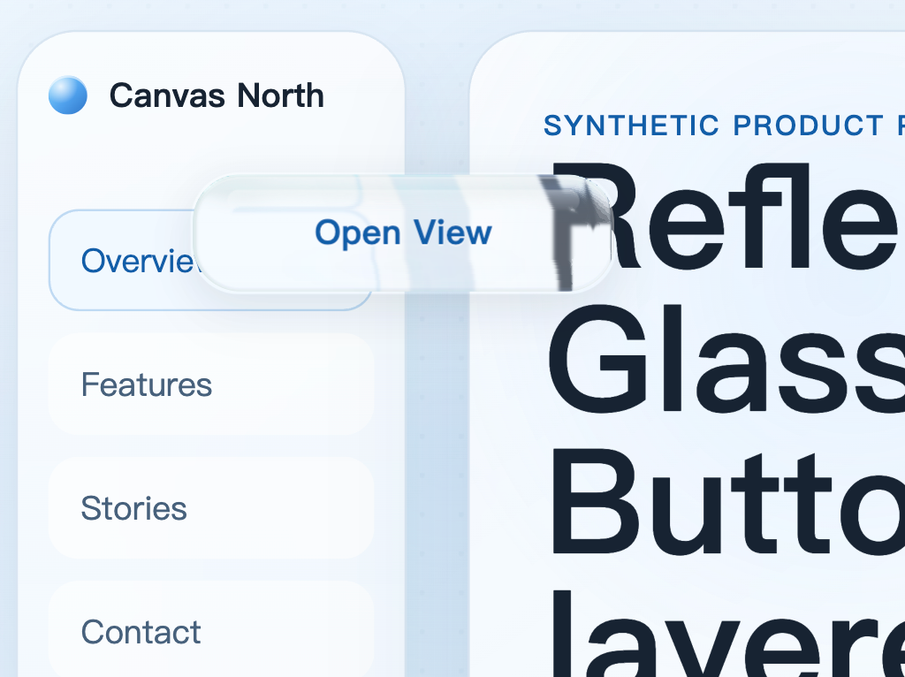
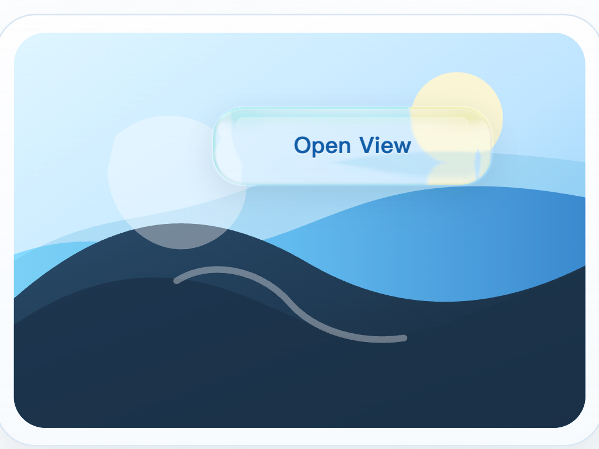
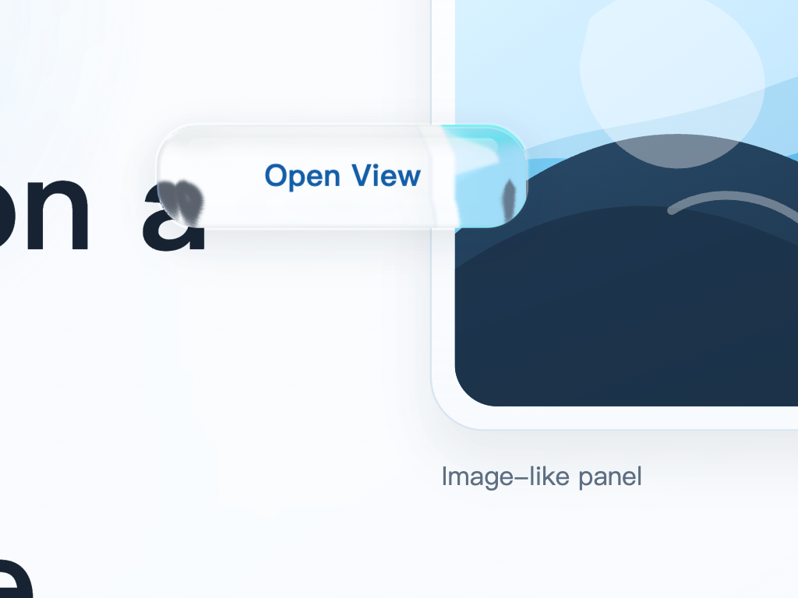

# Reflect Glass Button

A standalone, framework-free reflect glass button example built around a
shape-specific optical asset pipeline: generated displacement/specular maps,
an inline SVG filter, layered CSS materials, and drag support.

This package is self-contained and does not include any application-specific
logic or branding.

## Showcase Captures

Three captures from the live showcase composition:

<p align="center">
  
  
  
</p>

## Recording

GitHub attachment playback:

https://github.com/user-attachments/assets/7d852b08-4c27-4827-ba61-e7f2b669e760

## Structure

```text
reflect-glass-button/
├── assets/
│   ├── circle-button/
│   ├── default-pill/
│   ├── hero-pill/
│   ├── motion-pill/
│   └── rounded-square-button/
├── demo/
│   ├── captures/
│   │   ├── showcase-capture-1.png
│   │   ├── showcase-capture-2.png
│   │   ├── showcase-capture-3.png
│   ├── demo.css
│   ├── index.html
│   ├── motion-shot.css
│   ├── motion-shot.html
│   ├── readme-motion.gif
│   ├── readme-preview.png
│   ├── readme-shot.css
│   ├── readme-shot.html
│   ├── showcase.css
│   └── showcase.html
├── scripts/
│   ├── generate-reflect-glass-assets.mjs
│   ├── verify-demo-consistency.mjs
│   └── serve.mjs
├── src/
│   ├── reflect-glass-prepaint.js
│   ├── reflect-glass-button.css
│   └── reflect-glass-button.js
├── IMPLEMENTATION.md
├── LICENSE
├── package.json
└── README.md
```

## Features

- Plain HTML, CSS, and JavaScript
- Shape-matched displacement/specular PNG assets generated inside the repo
- Built-in presets for pill, circle, and rounded-square buttons
- Chromium-only SVG refraction path that consumes those generated assets
- Draggable button with Pointer Events
- Glass effect built from layered gradients, inner highlights, and `backdrop-filter`
- Same core runtime reused across live demo, README screenshot, and motion capture
- No external artwork or runtime dependencies

## Quick Start

```bash
cd reflect-glass-button
npm run generate:assets
npm run verify:consistency
npm run dev
```

Open:

```text
http://127.0.0.1:4173
```

Additional demo pages:

- `http://127.0.0.1:4173/demo/`
- `http://127.0.0.1:4173/demo/showcase.html`
- `http://127.0.0.1:4173/demo/readme-shot.html`
- `http://127.0.0.1:4173/demo/motion-shot.html`

Generate a single preset:

```bash
npm run generate:assets -- --preset hero-pill
```

Built-in preset names:

- `default-pill`
- `hero-pill`
- `motion-pill`
- `circle-button`
- `rounded-square-button`

Generate a brand-new rounded-rect family preset without editing the script:

```bash
npm run generate:assets -- \
  --name campus-circle \
  --width 124 \
  --height 124 \
  --radius 62 \
  --rim 24
```

The built-in generator currently covers the rounded-rectangle family, so pills,
circles, and rounded squares all use the same workflow.

That will create `assets/campus-circle/` with:

- `displacement-map.png`
- `specular-map.png`
- `preset.json`

## Reuse In Another Project

1. Generate optical assets for the exact button shape you want.
2. Copy `src/reflect-glass-prepaint.js`.
3. Copy `src/reflect-glass-button.css`.
4. Copy `src/reflect-glass-button.js`.
5. Register an inline SVG filter that points at the generated
   `displacement-map.png` and `specular-map.png`.
6. Add this markup:

```html
<div class="reflect-glass-anchor" aria-hidden="true"></div>

<button
  class="reflect-glass-button"
  data-reflect-glass
  data-reflect-glass-anchor="#my-glass-anchor"
  type="button"
>
  <span class="reflect-glass-surface" aria-hidden="true"></span>
  <span class="reflect-glass-ornament" aria-hidden="true"></span>
  <span class="reflect-glass-label">Launch</span>
</button>
```

7. Set size, radius, and filter variables for your preset.

```css
.hero-glass-button {
  --reflect-glass-min-width: 430px;
  --reflect-glass-min-height: 128px;
  --reflect-glass-padding: 0 42px;
  --reflect-glass-radius: 38px;
  --reflect-glass-inner-radius: 37px;
  --reflect-glass-highlight-top: 10px;
  --reflect-glass-highlight-height: 24px;
  --reflect-glass-highlight-margin: 24px;
  --reflect-glass-glow-side: 30px;
  --reflect-glass-glow-bottom: 15px;
  --reflect-glass-glow-height: 18px;
  --reflect-glass-label-size: 1.8rem;
  --reflect-glass-label-letter-spacing: -0.02em;
  --reflect-glass-filter: url("#reflectGlassHero");
}
```

8. Load the prepaint script before the stylesheet if you want the first paint
   to match the demo exactly, then load the runtime and call `init()`.

```html
<script src="./reflect-glass-prepaint.js"></script>
<link rel="stylesheet" href="./reflect-glass-button.css" />

<script src="./reflect-glass-button.js"></script>
<script>
  window.ReflectGlassButton.init();
</script>
```

`init()` also runs browser detection, but the shared prepaint script avoids a
first-frame mismatch between the fallback glass and the Chromium refraction
path.

If the button dimensions or corner radius change materially, generate a new
preset. CSS-only resizing is not the same pipeline and will soften or mismatch
the refraction.

## API

The runtime exposes a small browser global:

```js
window.ReflectGlassButton.init(options?)
window.ReflectGlassButton.attach(element, options?)
window.ReflectGlassButton.detectBrowserEngine()
```

Supported options:

- `anchor`: DOM element used for initial placement
- `anchorSelector`: fallback selector for initial placement
- `dragThreshold`: number of pixels before drag suppresses click

Supported markup attributes:

- `data-reflect-glass-anchor="#selector"`: lets each button resolve its own
  initial anchor without separate `init()` calls

## Browser Behavior

- Chromium-based browsers use the generated SVG filter directly through
  `backdrop-filter: url(#reflectGlass...)` for stronger refraction.
- Other browsers fall back to a simpler frosted-glass treatment.
- Browsers without `backdrop-filter` support get a static translucent fallback.

## Implementation Notes

See [IMPLEMENTATION.md](./IMPLEMENTATION.md) for a breakdown of:

- optical asset generation
- custom preset creation
- SVG filter wiring
- visual layers
- drag behavior
- extraction guidance

## Acknowledgements

The material direction and CSS/SVG experimentation for this demo were inspired
by the Kube.io article
[`Liquid Glass with CSS + SVG`](https://kube.io/blog/liquid-glass-css-svg/).
Thanks to the author for publishing the technique breakdown.

## License

[MIT](./LICENSE)
